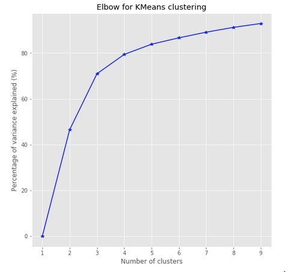
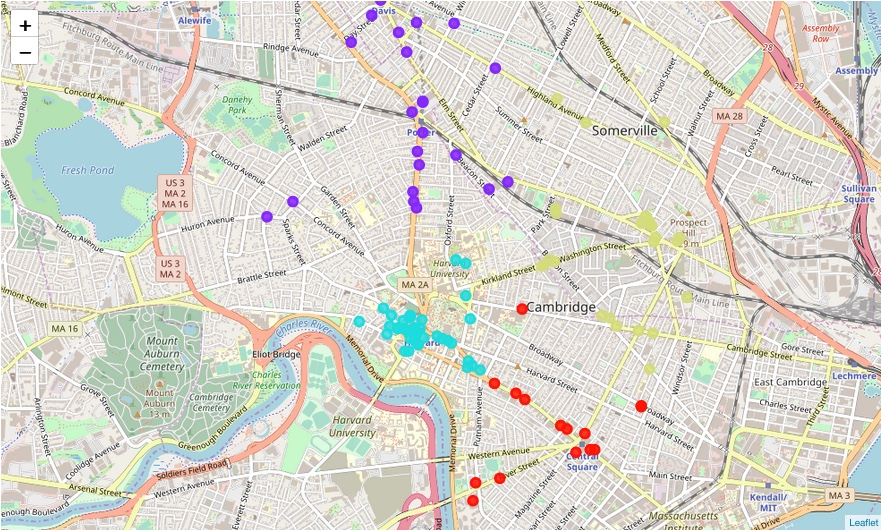
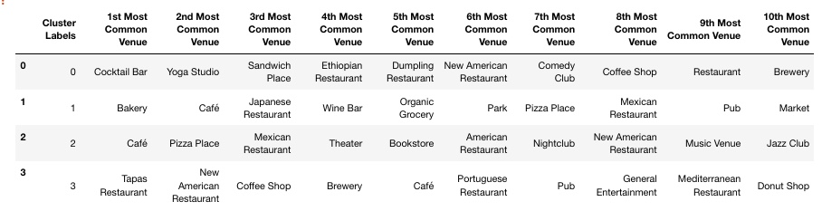

# Are you looking for a new place to live in Boston? #

Most people in Boston do not have a car.  Many would like to find an apartment close to reliable public transportation.  They need to be close enough to work to not have to commute more than 30 minutes one way.  Generally they want to have great services close to them.

When looking for a new apartment this type of information is not always easy to find.  We need a tool that will help us find services type information (FourSquare) within a reasonable distance from work allowing us to choose the right place to live.

## Data Information
Foursquare data will be used to get services information.  This will contain the types of venues available in a location.  Venue data includes ratings, stats (user counts and checking counts), likes, & price.  It also contains latitude and longitude data that can be used to calculate the exact distance from a given point.  

## Methodology

The intent is to have the person who is going to use this tool to put in their work location, and we will then pull the venue information around them within about a 30 minute commute radius. For this exercise I used a static address to represent the work location, but in future iterations, a variable could be used to input a new location from the end user.  I then pulled venues in 4 mile radius to approximate a 30 minute commute.  This could vary depending on traffic and mode of travel to work.  

I used K-Means to cluster the resulting venue locations into sections to represent geographic neighborhoods. Each cluster(neighborhood) will then show the user the types of venues in that neighborhood, helping to pinpoint the location the prospective apartment hunter might live.

## Results
Bringing in venues near the target location, I used K-Means clustering to build clusters to represent neighborhoods.

First I used the elbow method to determine the best number of clusters to chose.  In this case I chose 4.

I was then able to visualize the clusters on the map

Once they were clustered I transformed the data to show the most occurring type of venues in each cluster.

## Discussion
You can now see what the most common type of venue is in each cluster "Neighborhood".  You can see the location of the neighborhood on the map, and you can see just how many venues are in each Neighborhood.  This should help you make the decision on where you want to live.

I was unable to verify my FourSquare account so I couldn't download more venues.  The model still worked fairly well and was just more limited to a smaller radius around the center work location.  

## Conclusion
Boston is such a walkable city that there is most likely just about any type of venue you might like available within a walking distance from your home.  All you need to do is research ahead of time the surrounding venues of your prospective home.  With is tool you can choose a location near enough to your work that you will not have to commute far, and still have everything you like near you home.
